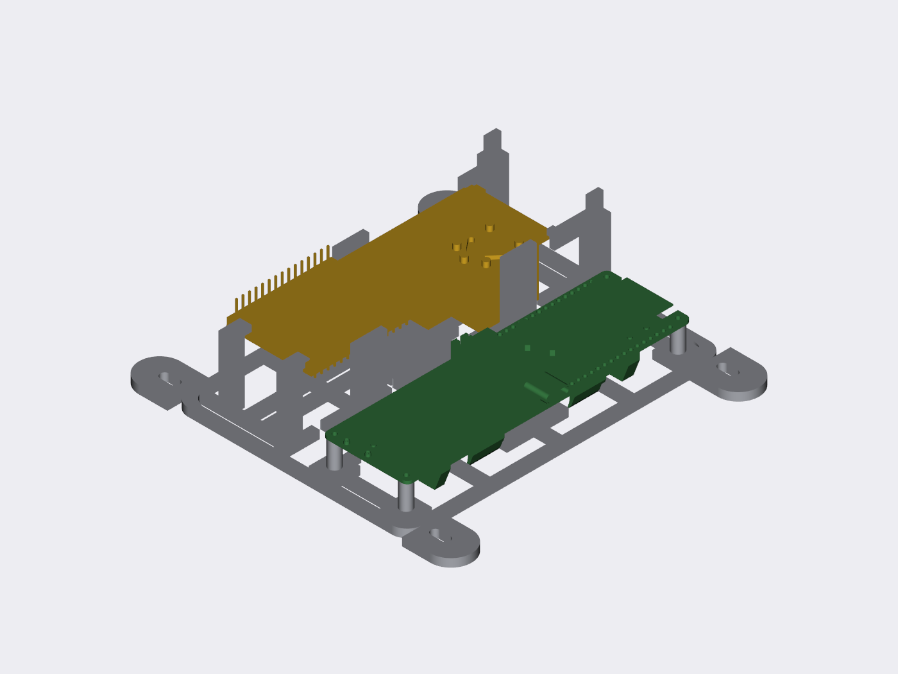

# LILYGO T-A7670X + T-SimHat Combined Carrier

Parametric, 3D-printable internal electronics carrier that holds a
**LILYGO T-A7670X ESP32 modem board** and a **LILYGO T-SimHat (single-relay
variant)** side-by-side — mounted separately, wired together with jumpers —
for subsequent installation inside a waterproof enclosure.

Fully scripted in **Python + CadQuery**, driven by **manufacturer STEP/DXF
geometry** (no guessed dimensions), validated programmatically, and
regenerable with one command.



*T-SimHat (amber) mounted flipped — relay down, pin headers up. T-A7670X
(green) on screw standoffs. Carrier (grey) 129 × 127.5 mm, fits a Bambu
A1 mini with large margin.*

## Status

`v0.1.0-prototype` — **all software validation checks pass; not yet
physically test-printed.** Print the snap-fit test coupon first (see below).

## Key measured dimensions (from manufacturer CAD)

| Item | Value | Source |
|---|---|---|
| T-A7670X PCB | 33.071 × 110.54 × 1.2 mm | STEP cross-section + DXF dim `33.071` |
| T-A7670X mounting holes | 4 × Ø1.73 mm, 27.71 × 105.59 mm grid | DXF hole-callout dims, cross-checked vs STEP cylinders |
| T-A7670X screw size | **M1.6** (hole Ø1.73) | derived, not assumed |
| T-SimHat PCB | 33.0 × 94.8 × **1.0 mm** | STEP cross-section (verify with calipers: some batches 1.6) |
| T-SimHat mounting holes | **none** (hence snap-in cage) | STEP |
| T-SimHat relay | OMRON G5LE-class, 16.5 × 22.7 × 18.25 mm, single relay confirmed in STEP | STEP solids |

## How the T-SimHat is held

No screws, no load on components:

- **4 support pads** (6 × 6 mm) contact **bare laminate only**, at grid
  positions verified clear of all 77 component solids in the STEP model
- **Fixed capture lip** at the far end (2 segments) hooks over the PCB top edge
- **2 flexible corner clips** at the near end snap over the PCB edge;
  flexure bends **in the XY print plane** (14 mm arms, ~1.6 % strain — PETG-safe)
- **3 fences** locate X/Y; board cannot slide or rotate
- **Removal:** press both release tabs → lift clip end 0.15 mm → slide out
  from under the lip (validated collision-free, incl. relay/SMD sweep paths)

## Quick start

```bash
uv venv .venv && uv pip install --python .venv/bin/python cadquery ezdxf trimesh numpy
.venv/bin/python scripts/analyze_step.py   # already run; regenerates analysis/*.json
.venv/bin/python scripts/build.py          # rebuilds exports/ + renders/
.venv/bin/python scripts/validate.py       # 14 checks -> analysis/interference_report.json
```

## Printing

- **First print the coupon:** `exports/simhat_clip_test.stl` — four labeled
  clearance variants (0.20/0.30/0.40/0.50 mm, notch-counted). Pick the best
  fit, then set `SIMHAT_PCB_XY_CLEAR` in `cad/parameters.py` and rebuild.
- Full carrier: flat on the plate as modeled, no supports needed.
  PETG starting settings in `docs/print_settings.md`.

## Reference provenance

Manufacturer geometry lives in `references/` (MIT-licensed, © LILYGO),
copied from the forks in `vendor/` — see `references/PROVENANCE.md` for
exact upstream commits. Forks: `Amperstrand/T-SimHat`,
`Amperstrand/LilyGo-Modem-Series` (upstream: `Xinyuan-LilyGO/...`).

## Layout

```
cad/parameters.py     every dimension in one place (measured values load from analysis/*.json)
cad/holder.py         parametric model: base frame, standoffs, snap cage, ears
scripts/analyze_step.py   STEP -> geometry JSON (holes, PCB slab, components)
scripts/analyze_dxf.py    DXF dimension cross-check
scripts/build.py      regenerates exports/ and renders/
scripts/validate.py   interference, watertight, envelope, features, removal
exports/              carrier + coupon STL/STEP, assembly STEP
analysis/             machine-readable geometry + validation reports
docs/                 design decisions, assembly, print settings
```

All parameters — standoff height, board gap, clip geometry, ear positions,
pad locations, clearances — are in `cad/parameters.py`.

## Repository

- GitHub: `Amperstrand/lilygo-a7670-simhat-carrier` (private)
- Branch: `cad/combined-carrier-v1`
